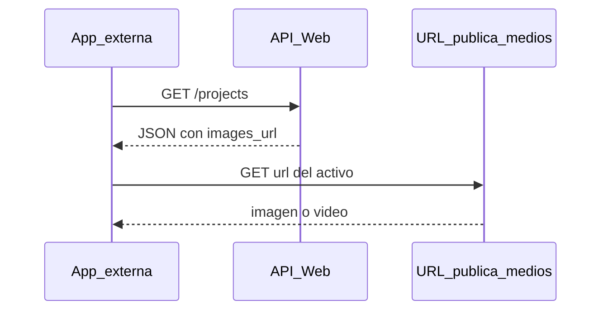

# API Web — Catálogo público de proyectos

Guía para **aplicaciones externas** (sitio web, app móvil, landing, etc.) que consumen el catálogo de proyectos vía HTTP.

**Alcance:** solo lectura del catálogo. No cubre administración del CRM, subida de archivos ni configuración del servidor.

---

## 1. Resumen


| Concepto         | Valor                                   |
| ---------------- | --------------------------------------- |
| URL base del API | `{BASE_URL}/api/v1/web`                 |
| Ejemplo          | `https://api.ejemplo.com/api/v1/web`    |
| Formato          | JSON                                    |
| Autenticación    | **Ninguna** (no enviar `Authorization`) |
| Rate limit       | 120 solicitudes por minuto por IP       |
| Métodos          | Solo `GET`                              |

Este API alimenta **varias páginas web** (`lotesenremate.pe`, `inviertexpress.pe`, etc.). En el **listado** `GET /projects` debes enviar siempre el query `tipo_web` con el sitio que consume el catálogo; solo recibirás proyectos publicados para ese destino.


`{BASE_URL}` es el dominio que te indique el equipo del backend (producción o staging). Todas las rutas de este documento se concatenan a ese origen.

**Cabecera recomendada**


| Cabecera | Valor              |
| -------- | ------------------ |
| `Accept` | `application/json` |


---

## 2. Inicio rápido

```bash
curl -s -H "Accept: application/json" \
  "https://api.ejemplo.com/api/v1/web/projects?tipo_web=lotesenremate.pe&per_page=5"
```

Respuesta (`200`):

```json
{
  "summary": {
    "projects_count": 4,
    "lots_total": 295,
    "lots_free": 120,
    "images_total": 8,
    "videos_total": 0
  },
  "meta": {
    "current_page": 1,
    "per_page": 5,
    "total": 4,
    "last_page": 1,
    "from": 1,
    "to": 4
  },
  "data": [
    {
      "id": 1,
      "name": "Villa Norte - Mito",
      "location": "Mito",
      "free_lots_count": 12,
      "images": [],
      "videos": []
    }
  ]
}
```

Detalle de un proyecto:

```bash
curl -s -H "Accept: application/json" \
  "https://api.ejemplo.com/api/v1/web/projects/1"
```

---

## 3. Endpoints

### 3.1 Listado — `GET /projects`

**URL:** `{BASE_URL}/api/v1/web/projects`

Devuelve `summary`, `meta` y `data` (array de proyectos) **del sitio indicado en `tipo_web`**.

Cada front (landing, catálogo, etc.) debe fijar `tipo_web` según su dominio. Valores permitidos:

| `tipo_web`           | Uso típico              |
| -------------------- | ----------------------- |
| `lotesenremate.pe`   | Sitio Lotes en Remate   |
| `inviertexpress.pe`  | Sitio Inviert Express   |

Proyecto visible en el listado cuando: `is_active = true`, `is_web = true` y `tipo_web` coincide con el query.

#### Query params


| Parámetro         | Tipo   | Default | Descripción                                                                         |
| ----------------- | ------ | ------- | ----------------------------------------------------------------------------------- |
| **`tipo_web`**    | string | —       | **Obligatorio.** Sitio consumidor: `lotesenremate.pe` o `inviertexpress.pe`        |
| `page`            | int    | `1`     | Página actual (mín. 1)                                                              |
| `per_page`        | int    | `15`    | Ítems por página (máx. 50)                                                          |
| `search`          | string | —       | Busca en nombre y coordenadas/enlace Maps (parcial)                                 |
| `location`        | string | —       | Coincidencia exacta del valor guardado (coordenadas `lat,lng` o URL de Google Maps) |
| `project_type_id` | int    | —       | ID del tipo de proyecto                                                             |
| `has_free_lots`   | bool   | —       | `1` o `true`: solo con lotes disponibles (`LIBRE`)                                  |
| `has_images`      | bool   | —       | Solo con al menos una imagen                                                        |
| `has_videos`      | bool   | —       | Solo con al menos un vídeo                                                          |
| `order`           | string | `name`  | `name`, `name_desc`, `lots_desc`, `free_lots_desc`                                  |


**Orden (`order`)**


| Valor            | Resultado                     |
| ---------------- | ----------------------------- |
| `name`           | Nombre A→Z                    |
| `name_desc`      | Nombre Z→A                    |
| `lots_desc`      | Más lotes registrados primero |
| `free_lots_desc` | Más lotes libres primero      |


**Ejemplo con filtros**

```
GET /api/v1/web/projects?tipo_web=lotesenremate.pe&search=Olivos&has_free_lots=1&per_page=10&page=1&order=free_lots_desc
```

**Respuestas**


| Código | Significado                                 |
| ------ | ------------------------------------------- |
| `200`  | OK                                          |
| `422`  | Parámetro inválido (ver sección 7)          |
| `429`  | Demasiadas peticiones; esperar y reintentar |


---

### 3.2 Detalle — `GET /projects/{id}`

**URL:** `{BASE_URL}/api/v1/web/projects/{id}`

Un solo proyecto en `data`. Misma estructura que un elemento del listado (sin `summary` ni `meta`).


| Código | Significado                                                     |
| ------ | --------------------------------------------------------------- |
| `200`  | OK                                                              |
| `404`  | Proyecto no existe o no visible en web (`is_active` e `is_web`) |


---

### 3.3 Redirección de activo — `GET /projects/{projectId}/assets/{assetId}`

**URL:** `{BASE_URL}/api/v1/web/projects/{projectId}/assets/{assetId}`

**Opcional.** Responde `302` hacia la URL pública del archivo. En integraciones nuevas usa directamente el campo `url` del JSON (listado o detalle); no hace falta llamar a esta ruta.


| Código | Significado                      |
| ------ | -------------------------------- |
| `302`  | Redirección a la URL del archivo |
| `404`  | Activo o proyecto no válido      |


---

## 4. Estructura de la respuesta

### 4.1 `summary` (solo listado)

Totales del **sitio** (`tipo_web` del request): proyectos visibles en web para ese destino y sus lotes/activos. No incluye otros sitios ni proyectos solo de CRM.


| Campo            | Tipo | Descripción                                              |
| ---------------- | ---- | -------------------------------------------------------- |
| `projects_count` | int  | Proyectos con `is_web` y el `tipo_web` solicitado        |
| `lots_total`     | int  | Lotes de esos proyectos                                  |
| `lots_free`      | int  | Lotes `LIBRE` de esos proyectos                          |
| `images_total`   | int  | Imágenes activas de esos proyectos                       |
| `videos_total`   | int  | Vídeos activos de esos proyectos                         |


### 4.2 `meta` (solo listado)

Paginación del resultado **filtrado** (mismo `tipo_web` y filtros opcionales).


| Campo          | Tipo     | Descripción                       |
| -------------- | -------- | --------------------------------- |
| `tipo_web`     | string   | Sitio aplicado en la consulta     |
| `current_page` | int      | Página actual                     |
| `per_page`     | int      | Tamaño de página                  |
| `total`        | int      | Proyectos que cumplen los filtros |
| `last_page`    | int      | Última página                     |
| `from`         | int|null | Primer ítem de la página          |
| `to`           | int|null | Último ítem de la página          |


`summary.projects_count` coincide con `meta.total` si no hay filtros opcionales (`search`, `has_free_lots`, etc.). Con filtros, `meta.total` puede ser menor.

### 4.3 Proyecto (`data[]` o `data`)


| Campo             | Tipo        | Descripción                                                                                       |
| ----------------- | ----------- | ------------------------------------------------------------------------------------------------- |
| `id`              | int         | ID del proyecto                                                                                   |
| `name`            | string      | Nombre                                                                                            |
| `location`        | string|null | Coordenadas Google Maps (`latitud,longitud`) o enlace de Google Maps tal como se guardó en el CRM |
| `maps_url`        | string|null | Enlace para abrir en Google Maps (derivado de `location`)                                         |
| `location_label`  | string|null | Texto sugerido para el enlace (ej. «Abrir en Google Maps»)                                        |
| `blocks`          | array       | Sectores o bloques                                                                                |
| `total_lots`      | int|null    | Lotes planificados                                                                                |
| `lots_count`      | int         | Lotes registrados                                                                                 |
| `free_lots_count` | int         | Lotes en estado `LIBRE`                                                                           |
| `project_type`    | object|null | `{ id, name, code }`                                                                              |
| `image_portada`   | string|null | URL pública de la portada (preferida para tarjetas)                                               |
| `tipo_web`        | string|null | Sitio destino: `lotesenremate.pe` o `inviertexpress.pe`                                           |
| `city`            | object|null | `{ id, name, department }`                                                                        |
| `province`        | string|null | Provincia                                                                                         |
| `district`        | string|null | Distrito                                                                                          |
| `project_zone`    | string|null | Zona de proyecto                                                                                  |
| `registry_status` | string|null | Estado registral                                                                                  |
| `images_count`    | int         | Cantidad de imágenes en la respuesta                                                              |
| `videos_count`    | int         | Cantidad de vídeos en la respuesta                                                                |
| `images`          | array       | Activos imagen                                                                                    |
| `videos`          | array       | Activos vídeo                                                                                     |


### 4.4 Activo (imagen / vídeo)


| Campo       | Tipo   | Descripción                                                     |
| ----------- | ------ | --------------------------------------------------------------- |
| `id`        | int    | ID del activo                                                   |
| `kind`      | string | `image`, `video`, etc.                                          |
| `title`     | string | Título                                                          |
| `file_name` | string | Nombre de archivo                                               |
| `mime_type` | string | MIME                                                            |
| `file_size` | int    | Bytes                                                           |
| `url`       | string | URL absoluta del archivo (usar en ``, `<video>`, descarga) |


---

## 5. Reglas que debe conocer tu app

### Lotes libres

- `free_lots_count` cuenta lotes con código de estado `**LIBRE`**.
- Puedes filtrar el listado con `has_free_lots=1`.

### Medios

- Solo aparecen activos **activos**, ordenados por prioridad de visualización.
- **Imagen:** `kind` es `image` o `mime_type` empieza por `image/`.
- **Vídeo:** `kind` es `video` o `mime_type` empieza por `video/`.
- PDFs y documentos **no** vienen en este API.

### Uso de `url`

Cada imagen o vídeo trae `url` lista para usar:

```html

```

No necesitas token ni cabeceras extra para cargar ese recurso. Si `url` devuelve 404, muestra un placeholder en tu UI.

### Lo que este API no ofrece

- Login ni tokens.
- Alta o edición de proyectos, lotes o clientes.
- Listado de lotes por proyecto.
- Subida de archivos.

Para esas funciones existen otros APIs internos del CRM (no documentados aquí).

---

## 6. Paginación

**Primera página (por defecto):**

```
GET /api/v1/web/projects
```

**Página siguiente:** incrementa `page` y repite los mismos filtros:

```
GET /api/v1/web/projects?page=2&per_page=15&search=Olivos
```

**Ejemplo en código:**

```javascript
const hasNext = meta.current_page < meta.last_page;
const nextPage = meta.current_page + 1;
```

---

## 7. Errores


| Código | Cuándo                     | Qué hacer en tu app                                         |
| ------ | -------------------------- | ----------------------------------------------------------- |
| `422`  | Query param inválido o falta `tipo_web` en listado | Revisar `errors` en JSON; en listado siempre enviar `tipo_web` |
| `404`  | ID de proyecto inexistente | Página “no encontrado”                                      |
| `429`  | Rate limit                 | Mensaje “intenta más tarde”; backoff                        |


**Ejemplo `422`** (`per_page` > 50):

```json
{
  "message": "The per page field must not be greater than 50.",
  "errors": {
    "per_page": ["The per page field must not be greater than 50."]
  }
}
```

---

## 8. Ejemplos por plataforma

### curl

```bash
BASE="https://api.ejemplo.com"

curl -s -H "Accept: application/json" "$BASE/api/v1/web/projects?tipo_web=lotesenremate.pe&per_page=10"
curl -s -H "Accept: application/json" "$BASE/api/v1/web/projects?tipo_web=inviertexpress.pe&search=Mito&has_free_lots=1"
curl -s -H "Accept: application/json" "$BASE/api/v1/web/projects/4"
```

### JavaScript / TypeScript (fetch)

```typescript
const BASE_URL = 'https://api.ejemplo.com';

type CatalogResponse = {
  summary: { projects_count: number; lots_free: number };
  meta: { current_page: number; last_page: number; total: number };
  data: Array<{
    id: number;
    name: string;
    location: string | null;
    free_lots_count: number;
    images: Array<{ url: string; title: string }>;
  }>;
};

async function fetchProjects(page = 1): Promise<CatalogResponse> {
  const params = new URLSearchParams({
    tipo_web: 'lotesenremate.pe',
    page: String(page),
    per_page: '12',
    has_free_lots: '1',
  });

  const res = await fetch(`${BASE_URL}/api/v1/web/projects?${params}`, {
    headers: { Accept: 'application/json' },
  });

  if (!res.ok) {
    throw new Error(`API ${res.status}`);
  }

  return res.json();
}
```

### React (web)

```jsx

```

### React Native

```jsx
import { Image } from 'react-native';

<Image
  source={{ uri: project.images[0]?.url }}
  accessibilityLabel={project.images[0]?.title}
  style={{ width: '100%', height: 200 }}
/>
```

Usa la misma `BASE_URL` en una variable de entorno de tu app (`.env`, `app.config.js`, etc.).

---

## 9. Flujo de integración




1. Configura `BASE_URL` en tu aplicación.
2. Listado: `GET /projects` con paginación y filtros según tu UI.
3. Detalle: `GET /projects/{id}` al abrir un proyecto.
4. Renderiza medios con `images[].url` y `videos[].url`.
5. Maneja `404`, `422` y `429` en la interfaz.

---

## 10. Checklist del integrador

- Tienes la `BASE_URL` correcta (staging vs producción).
- Todas las peticiones llevan `Accept: application/json`.
- No envías cabeceras de autenticación.
- Paginación: usas `meta.last_page` y repites filtros en cada `page`.
- Imágenes/vídeos cargan desde `url`, no desde rutas inventadas.
- Probaste un `url` de ejemplo en navegador o emulador.
- Manejas `429` sin reintentar en bucle agresivo.

---

## 11. Respuesta completa de ejemplo (listado)

```json
{
  "summary": {
    "projects_count": 4,
    "lots_total": 295,
    "lots_free": 120,
    "images_total": 8,
    "videos_total": 2
  },
  "meta": {
    "current_page": 1,
    "per_page": 15,
    "total": 4,
    "last_page": 1,
    "from": 1,
    "to": 4
  },
  "data": [
    {
      "id": 4,
      "name": "Residencial Los Olivos",
      "location": "Concepción",
      "blocks": ["A", "B"],
      "total_lots": 120,
      "lots_count": 120,
      "free_lots_count": 45,
      "project_type": {
        "id": 1,
        "name": "Residencial",
        "code": "RESIDENCIAL"
      },
      "images_count": 1,
      "videos_count": 0,
      "images": [
        {
          "id": 10,
          "kind": "image",
          "title": "Masterplan",
          "file_name": "plan.png",
          "mime_type": "image/png",
          "file_size": 245760,
          "url": "https://api.ejemplo.com/storage/projects/4/images/abc123.png"
        }
      ],
      "videos": []
    }
  ]
}
```

---

*Contrato implementado en el backend Laravel (`/api/v1/web`). Ante cambios de campos o rutas, el equipo del API debe actualizar este documento.*